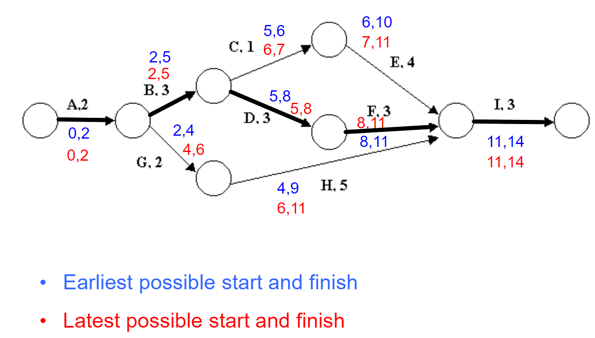

# Planning a project

## what a plan should look at:
* keeps track if your on time

* estimates how long a project will take

* what resources you need

A well-written plan can help you convince your customer to extend your deadline, or to reduce requirements.

## Flexibility
* Be able to change the plan if something goes wrong.

## An accurate plan needs:
* The scope (what we will achieve in in each phase)

* resources (how many people can we have working in parallel etc) - how to use the resources most effectively.

* Experience (consider and make use of others' experience) - then use it to drive your timescales

## Software scope:
Start by making a prototype, using its basic functionality
* what are the inputs outputs of the system

* Are there any performance constraints

* How reliable must the system be? (If its an aircraft control system it must be extremely reliable)

## Resources
* How much equipment is there? what we can we use
* What staff can be employed 
* Can any existing software be re-usable here

## Experience
* See if anyone has simliar experience of these kinds of projects

## Milestones
* What you will acchieve by each week.
    * This lets you know if you're on schedule or not.

## PERT(Program Evaluation and Review Technique) charts:
* A visual graph containing all activitise that need to take place and how they're related to one another.
* This lets us see which tasks need to come before others.

* The tasks are shown by arrows
* task names are letters in this case
* Circles are nodes. Represent start end of a task
* Task duration shown by numbers

#### What a pert chart provides us:
* expected project completion time
* Critical path activities that directly impact completion time
* The difference in the latest and earliest finish of each activity is that activity's **slack**
* activities that have slack time can lend resources to critical path activities
* activity start and end dates

note to self:look at working out latest time and document it in an easy to understand format.

#### Critical paths
* The path that has the same ealiest and latest start/finish times.
    * They cannot be delayed otherwise they delay the entire project
    * (There's no room for time extensions)

## Pert Chart notation:

