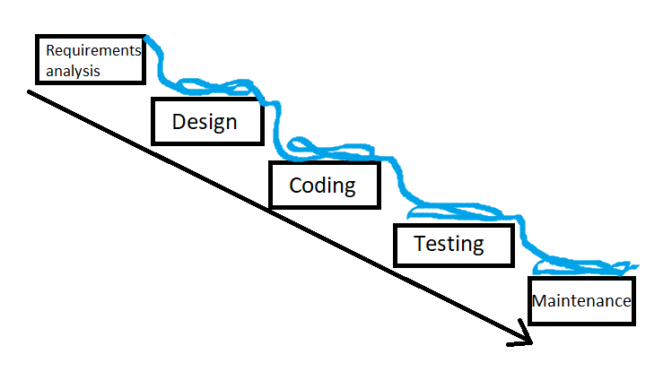

# Software Engineering Introduction

Software engineering projects are normally:
* large
* complex
* collaborative
* maintained by teams rather than by individuals

Often problems arise regardeless of the quality of caode and this can be very bad and expensive.
(For example making sure errors in metrics don't occur. A Nasa team measured using km and another team in metric units with their Mars Polar Lander)

## Approaches:
* Waterfall
* Agile
    * Quicker
    * more adaptable

## Waterfall Method:
* requirements analysis
* Design
* Coding
* Quality and Quality Assurance (testing/maintanance)

## Disadvantages

* Many documents(documentation) tend to be very very large
* Inflexible - requirements often change between analysis and development

## Requirements analysis:

* A statement of what the system has to do
* checklist of necessary features
* some analysis of the structure of the task. (Including abstractions that have been made)

## Why plan based development?

* simple to manage
* easy for a team to follow
* documentation provides progress to clients