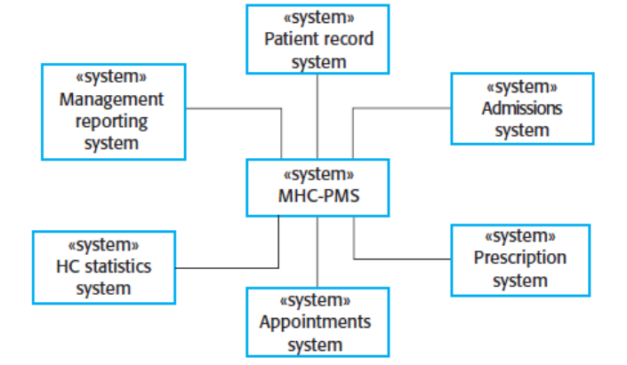
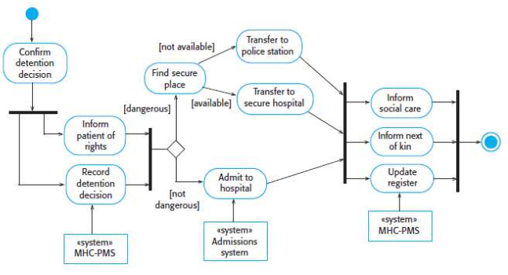
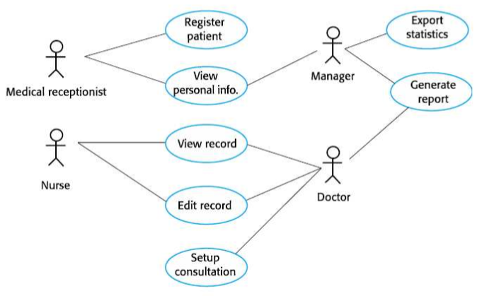
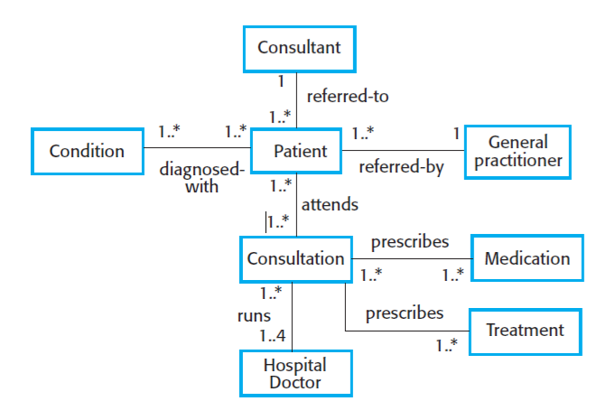
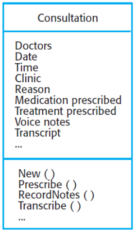

# Design

## System Modelling:
- The processes of developing abstract models of a system.
- Each model will represent a different view or perspective of that system
- These help the analyst understand the functionality of the system. These models are also used to show to the customers.

--- 

## Kinds of model:

- External perspective
    - model the context or environment of the system

- An interaction perspective:
    - Model the interactions between a system and its environment, or between its components.

- A structural perspective:
    - model the organisation of a system.
    - or the structure of the data that is processed by the system.

- A behavioral perspective:
    - model the dynamic behaviour of the system
    - and how it responds to events

## specific Models:

- Context models
    - A very high level view of a system

- Activity/process diagrams
    - activities involved in a process or in data processing

- Use case diagrams
    - interactions between a system and its environment

- Sequence diagrams
    - interactions between actors and the system and between system components

- Class diagrams
    - object classes in the system and the associations between these classes

- State diagrams
    - how the system reacts to internal and external events

---

## Context Model:

#### context Model example:
(Context model of a patient medical records system)

- Context models show other systems that involved with the software.

---

## Process model:
(Process model for "involuntary detention" - detaining someone if they are a danger to themselves)

---

## Use case model:

- This models what interacts with a system. This might be other systems/players etc.

## Sequence diagrams:

- This shows us how these entities will interact with each other.

- They are often used to show how classes interact with each other in object oriented programming.

- It will show the interactions that take place during a particular use case.

- The objects and actors involved are listed along the top of the diagram, with a dotted line drawn vertically from these.

- Interactions between objects are indicated by annotated arrows.

---

## Structural models:
- They display the organisation of a system
    - In terms of components that make up the system and their relationships

#### Structural models may be:
- static models, which show structure of system
- dynamic models, which show organisation of system when it is executing.

---

## Class diagrams
- Used to show the classes in a system and the associations between these calsses.
    - often used wen the system is object oriented.

- An object class represents a useful entity in a software system
- An association is a link between classes that indicates relationships between them.

- Above, for consultation, we have its:
    - attributes
    - methods