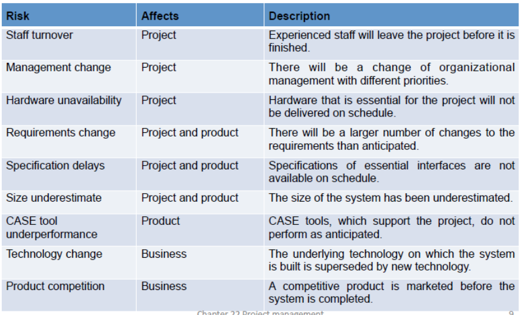
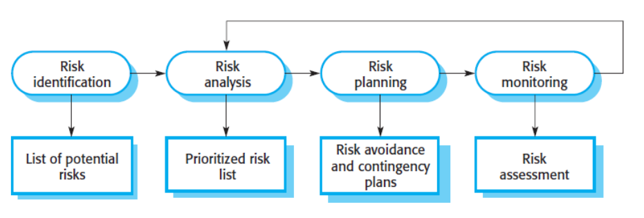
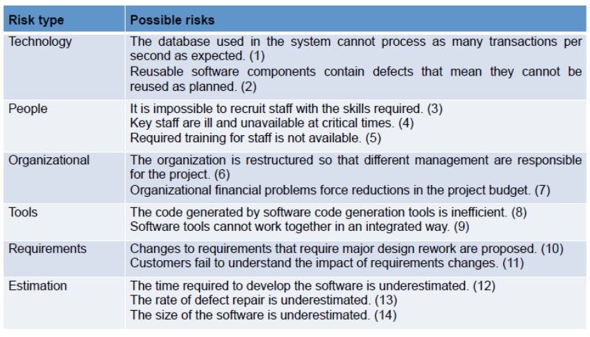
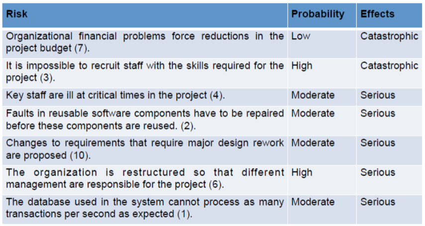
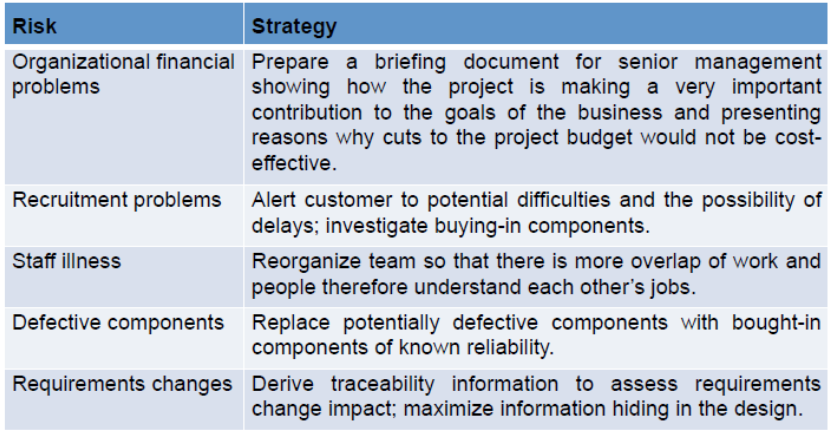
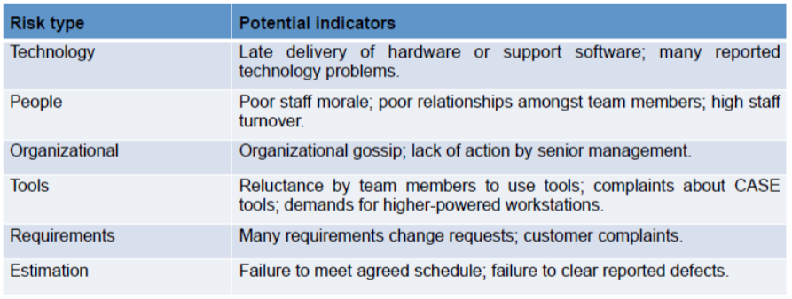

# Project Management

Essentially, project management is making sure the project goes as planned.

## project management involves:
* delivering on time/On schedule
* making sure project is in accordance with the requirements

Project management is needed because of the constraints projects have such as:
* budgets
* A schedule

These need to be managed so that progress about the software can be given to the customer.

## Success criteria:
What makes a project sucessful:
* deliver sotware on agreed time to customer
* keep delivery costs within budget
* deliver software that meets customers expectations
* maintain happy/well-functioning team

## problems:
* **intangible**, you cannot simply see progress. (Unlike the construction of a building, which is easier to quantify) 
* **Projects may be unique/one off's.** Therefore it can be hard to anticipate the difficulty of problems
* Hard to prodict when a software process may lead to development problems

## Role of project manager:
* Proposal preperation
* project planning
    * Time planning
    * resource planning (skill sets of team members)
    * Motivating teams
* Reporting (keeping customer informed/up-to-date)
* Risk management
    * what to do when something is not going well. Be able to recognise it isn't going well, and have a plan of what to do about it.

## Risk Management:

* It is the process of identifying risks and making plans to minimise their effect on the project.

* Risk can impact:
    * resources
    * timescale
    * (lower) quality and performance of software
    * The organisational stability

## Steps for risk management:
* **Risk identification**
* **Risk analysis**
* **Risk impact** (how much of a problem it could be)
* **Risk planning** (what do do if it happens) also called mitigation
* **Risk monitoring** (How to detect if the risk is increasing or not)

## Risk identification:
* having a list of risks that may happen is useful. Analysing them in depth can help plan prevent them (see tables below)

#### Risk types

#### Quantifying risk:

#### Risk management strategies:

#### Risk indicators:

