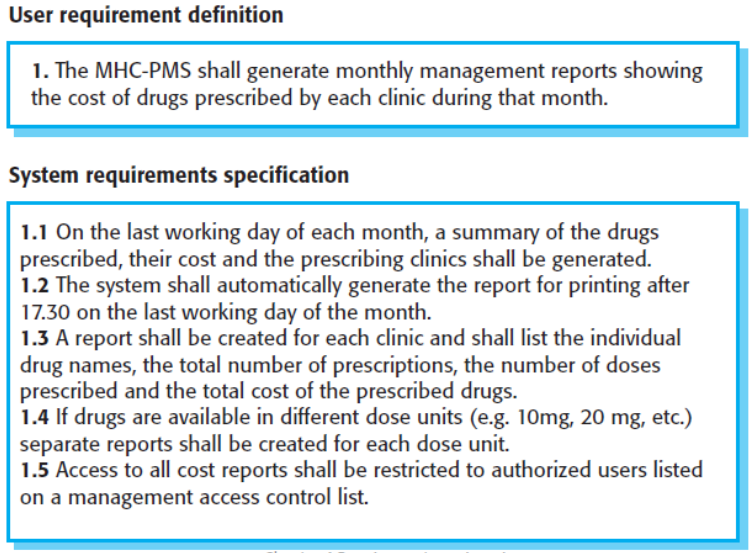
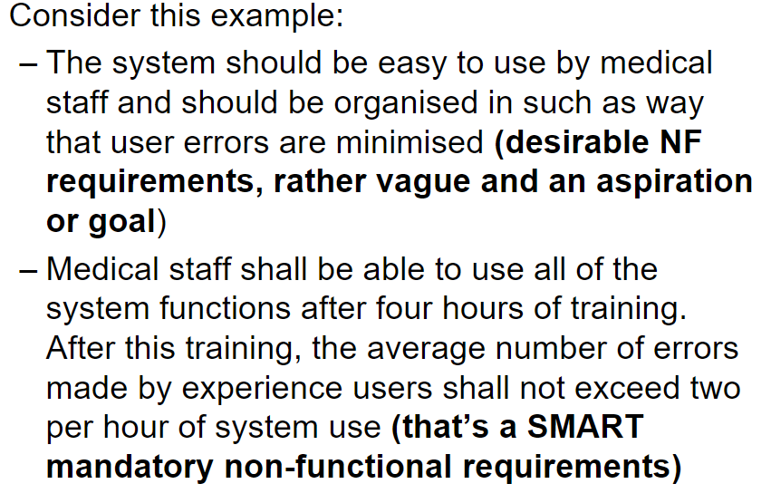

# Requirements Engineering Pt.1

- The process of establishing the services that a customer wants in their system.
- Requirements themselves are the descriptions of the system.
    - This includes the constraints that can appear when requirement engineering

## What is a requirement?

- It will describe a useful aspect of what we want to acchieve.
    - The requirements can also be a basis for a legal contract.
    - If you make a game that can only have 4 characters, but the requirements said it should have 6. The customer could say you haven't built what they asked for.

## Requirements abstraction

- The customer should provide what they want. They should abstract their requirements so they don't predefine a solution.
    - e.g. They shouldn't say what languages to use, just what they want.

State **what** you want to acchieve
**NOT HOW** it is to be done.

## Types of requirements

- User Requirements (**User Stories**):
    - Written by the customer

- System Requirements (**Task Cards**)):
    - Development team centered.
    - Should be a detailed description of the system services and operational contraints.

**User requirements give rise to system requirements, not the other way around.**

#### Example:

## Functional, non-functional and domain requirements

- Functional:
    - Features neccessary for the functionality of the system. Services the system needs to provide.

- Non-functional:
    - Desired requirements that are not necessary features to obtain functionality. Nevertheless, they are features that would be good

- Domain:
    - Requirements that will improve the system in its sector. A game would have a domain requirement to be 'fun', or the 'largest multiplayer platform'. These are requirements we often don't have a full understanding of.
        - It may also be a requirement that needs expert knowledge in that particular sector.

## S.M.A.R.T

A requirement should be:

- **S**pecific
- **M**easurable
- **A**chievable
- **R**ealistic
- **T**imely

## 'Dumb' balance:
**Examples** of bad requirements (for a system to manage medical appointmeants):

A 'dumb' requirement can be:

- A user shall be able to search the appointment lists for all clinics.
- The system shall have a contemporary user interface. 
    - (Contemporary can be an abstract term. It may mean different things for different people)

A good requirement:

- A user shall be able to display all free appointment slots for a specific clinic by selecting the clinic from a system generated list of all clinics in the health provider area and selecting the day, including the current day if required

## Completeness & consistency:

Requirements should be:
- Complete: tell us everything we need to know.
- Consistent: not contradict ourselves

## Non-functional requirements examples:

Can be:
- Reliability
- reponse time (e.g a search system and how long it takes to performa a search.)

## Non-functional requirements can lead to functional requirements:

- A non-functional requirement might emphasise the need for secure access to a system.

- This will lead to the rise of functional requirements if this is to be implemented.
    - e.g. The system shall be accessed using a five digit code.
    - Each code is unique to each operator

## Goals vs requirements:
- A comparison between a vague requirement and SMART requirement.

## Domain requirements example:

- “the train control system has to take into account the braking characteristics in different weather conditions”

- The train specialists may have provided a requirement like this assuming the software engineers would know how to tackle the problem.
    - They will be expressed in the language of the expert/customer/end user (end user may be a train driver)