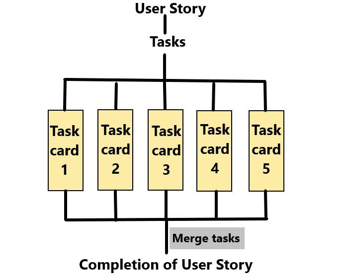

# Seminar 1 - User Story & Task Cards

## User Stories

- They are given by the customer

- They are a requirement(from the specification)

## Task cards

- A user story can be split into multiple task cards.

- Once these tasks are complete, you can combine them to reach the completion of a user story.

## Functional

- 'Functional' refers to how many people are working.

- When there are 5 people on a team and only 3 are working, you're team isn't very functional. (2 of your team mates are dormant)

- You can think of this as the progress you are making. Is it currently functional or not?

## Sprint

- In agile programming, a sprint is on iteration over a time period.

- Industry standard sprint times are normally 2 weeks long, but can vary.

- Over the sprint, you will aim to complete a specific user story.

#### Overlap

- Overlap is when a requirement(user story) cannot be completed in its sprint.
    - It will then overlap into the next sprint.
    - (In the next sprint, the overlapping task is the first sprint you will complete)

## Milestones
- Milestones are goals

- e.g. after 4 sprints we want an application made.

## Service based vs Product based
- Companies can be of two types - service based or product based.

- Service based - when a company provides software for a client who cannot make it themselves.

- Product based - when a company makes software for themselves because their company surrounds a product. 
    - e.g. Adobe make software for themselves.

## Assumptions
- When looking at a user story, you should assume you don't know information outside of that story.
    - You do this because the customer might make changes in their requirements.

- In our software development example, the requirements say the board is made up of 40 locations. 
    - But we can assume that it has an infinite amount. Therefore, we may use a doubly-linked list rather than an array.
    - This will allow us to go forward and backwards without knowing the number of locations that there are on the board.
    - (It also allows us to change the number of locations if the customer decides they want more)